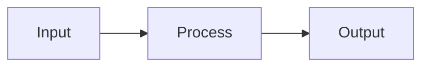

# Rule: Mermaid-Only Diagrams

## Context

To keep documentation consistent and readable in GitHub Pages, **ASCII diagrams are запрещены**. Only Mermaid diagrams are allowed.

## The Protocol

Whenever a diagram is needed in documentation or specs, you MUST:

1. Use Mermaid code blocks (e.g., ```mermaid)
2. Avoid ASCII art, box drawings, or monospace diagrams
3. Keep diagrams minimal and readable

## Examples

### ✅ Allowed (Mermaid)



### ❌ Disallowed (ASCII)

```
A --> B --> C
```

## Enforcement

If a diagram exists as ASCII, it must be converted to Mermaid before completion.
