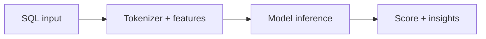

# MLQueryEngine

Orchestrates feature extraction, schema context, and model inference.

## Responsibilities

- Initialize ML model
- Process SQL queries into vectors
- Return performance score and insights

## Data flow

## Inputs

- SQL string
- Optional schema context (DDL)
- Optional live EXPLAIN and catalog data

## Outputs

- `performanceScore`
- `insights[]`
- `features`
