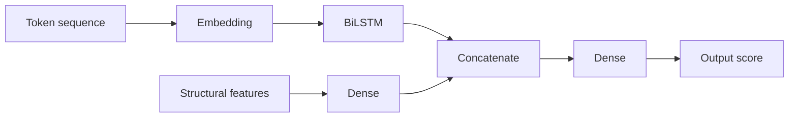

# QueryPerformancePredictor

Core ML model that predicts SQL performance and produces insights based on structural features.

## Model shape

## Responsibilities

- Run inference on token and feature inputs
- Produce a normalized score (0..1)
- Trigger heuristic insight rules based on feature thresholds

## Inputs

- Token sequence (fixed length)
- Structural features vector

## Output

- `performanceScore`: 0 to 1
- `insights`: heuristic insights based on key structural features

## Notes

- Scores are relative and intended for risk ranking
- Insights are rule-based even when ML is available
