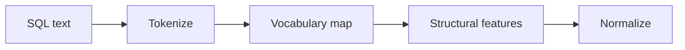

# SQLFeatureEngineer

Tokenizes SQL queries and extracts structural features for real-time prediction.

## Flow

## Responsibilities

- Tokenize SQL into a fixed-length sequence
- Extract lightweight structural features for inference
- Normalize values to a 0..1 range

## Features (v0.1)

Examples include join count, subquery depth, and LIKE wildcard risk.

## Inputs and outputs

- Input: raw SQL string
- Output: token sequence + feature vector
